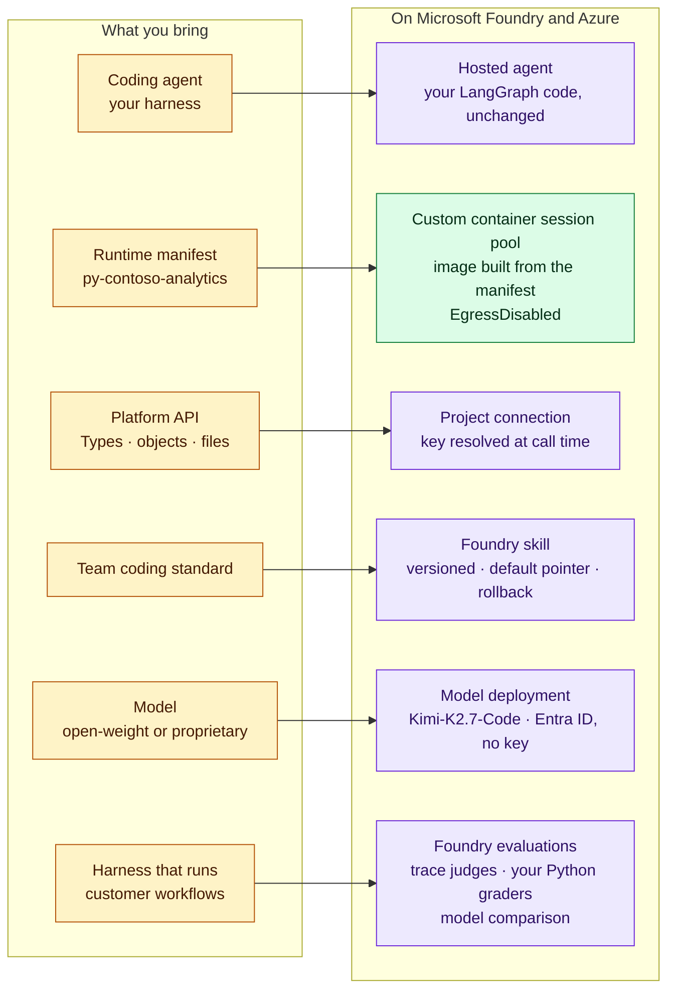

# Microsoft Foundry workshop reference samples

Reference material from a Microsoft Foundry workshop. Everything
here is meant to be **reproduced in your own Azure subscription**: each sample
has step-by-step setup, the commands to run, and recorded output to compare
against.

## What is here

| Folder | What it is | Start here |
| --- | --- | --- |
| [`coding-agent-custom-runtime/`](coding-agent-custom-runtime/) | A **coding agent for a model-driven application platform**, hosted on Foundry, running on the open-weight **Kimi-K2.7-Code** model (with `gpt-4.1-mini` as a baseline). It reads a Type from a platform API, writes the `.type` and `Type.py`, and tests the method in the **custom sandbox runtime** the method claims. It also covers platform credentials through a Foundry connection, team standards as versioned **Foundry skills**, and **Foundry evaluations** that read the agent's trace and compare the two models on the same tasks. | [`README.md`](coding-agent-custom-runtime/README.md) |
| [`offline-evaluation/`](offline-evaluation/) | Batch-evaluate an agent against a question set, then turn the results into a dataset you can upload for evaluation in the Foundry portal. | [`evaluate.py`](offline-evaluation/evaluate.py) |
| [`slide-deck/`](slide-deck/) | Slides for the evaluation session. | [`evaluation.pptx`](slide-deck/evaluations.pptx) |
| [`MultiAgent-AiFoundry/`](MultiAgent-AiFoundry/) | The Multi-Agent Custom Automation Engine solution accelerator on Foundry: Bicep infrastructure, backend, frontend and an MCP server. | [`src/mcp_server/README.md`](MultiAgent-AiFoundry/src/mcp_server/README.md) |

## The coding agent at a glance

How the pieces of a platform coding agent map onto Foundry and Azure in
[`coding-agent-custom-runtime/`](coding-agent-custom-runtime/):

The full architecture, the scenarios and the setup are in the sample's
[`README.md`](coding-agent-custom-runtime/README.md). The deeper references are
[`architecture.md`](coding-agent-custom-runtime/architecture.md) (trust
boundaries, identity and RBAC, skills lifecycle),
[`sandbox/README.md`](coding-agent-custom-runtime/sandbox/README.md) (building
the custom runtime), [`evaluation/README.md`](coding-agent-custom-runtime/evaluation/README.md)
(evaluating the agent and comparing models) and
[`findings.md`](coding-agent-custom-runtime/findings.md)
(what does not work today, and measured costs).

## Prerequisites common to all samples

- An Azure subscription where you can create resources and assign roles.
- A Microsoft Foundry project with a model deployment that supports tool
  calling. The coding agent uses Kimi-K2.7-Code; `gpt-4.1-mini` also works.
- Azure CLI, signed in with `az login`.
- Python 3.11 or later. Each sample lists its own packages and any extra
  prerequisites.

The Contoso platform, runtime library and Types used in the coding agent are
**fictional, written for these samples**. Replace them with your own platform
and SDK; only the agent's tool layer changes.
