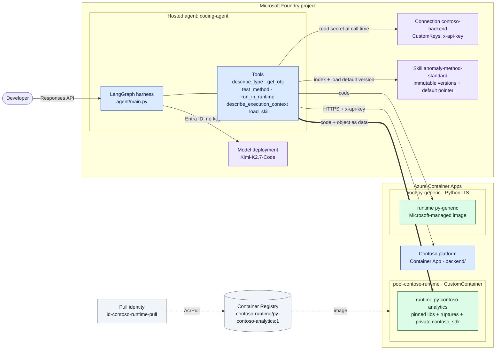
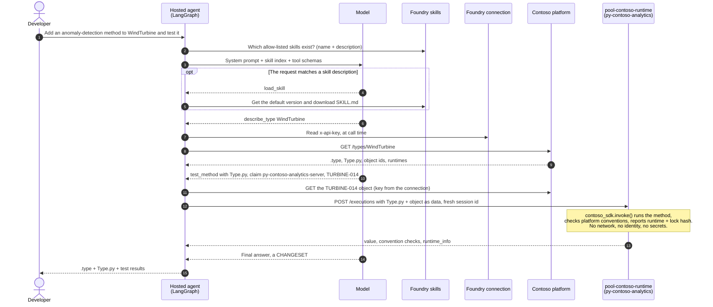
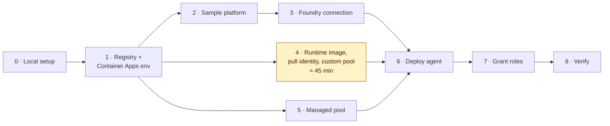
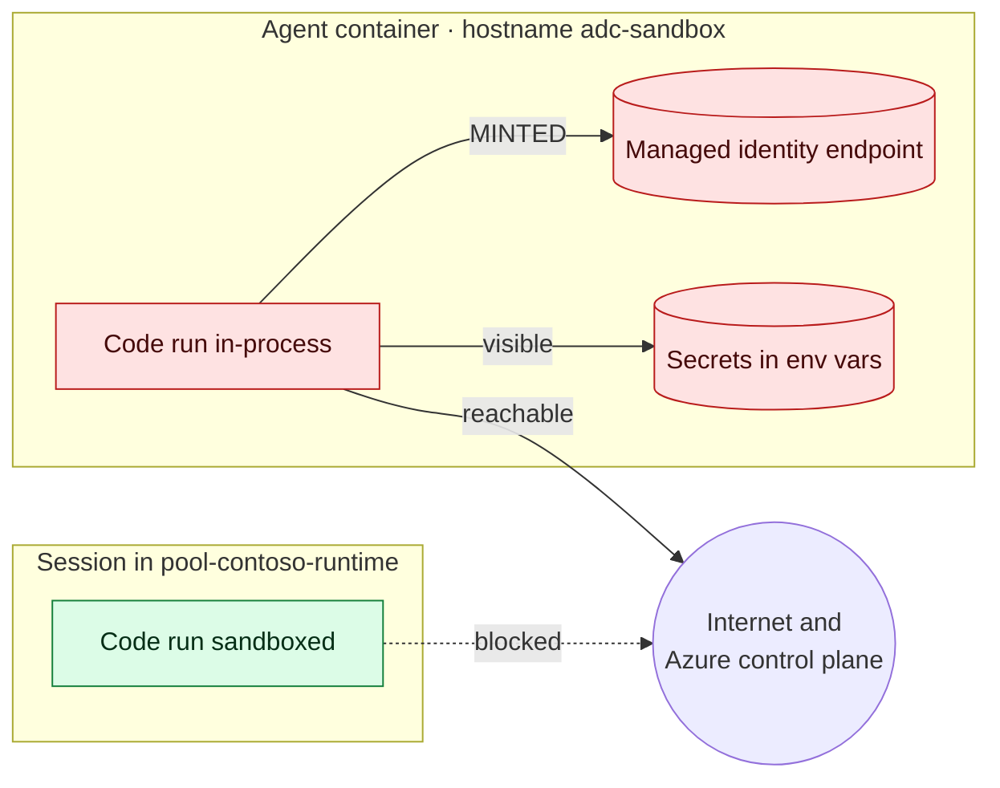
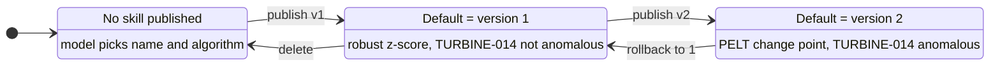

# A platform coding agent on Microsoft Foundry, with a custom sandbox runtime

A small coding agent for a model-driven application platform. A developer asks
for a method on a platform Type. The agent reads the Type from the platform, writes the `.type`
declaration and the `Type.py` implementation, and **tests the method on real
objects, in the runtime the method claims**, before it answers.

It answers three questions about running an agent like that on Foundry:

| Question | What this sample shows |
| --- | --- |
| Can we bring **our own harness**? | The agent is plain **LangGraph**. Foundry hosts it unchanged; there is no Microsoft agent framework in the code. |
| Can we run **model-written code** without handing it our identity? | Generated code runs in an **isolated session**, not in the agent's process. The two are measured side by side: no secrets, no identity, no egress in the sandbox. |
| Can we keep **our runtimes and libraries**? | The sandbox is built from a **runtime manifest**: pinned, frozen at build, with a private library. |
| Can we use **open-weight models**? | The agent runs on **Kimi-K2.7-Code**, an open-weight coding model deployed in Foundry, through the same API and Entra ID auth as any other deployment. Switching to `gpt-4.1-mini` is one setting. |

A fourth topic, **Foundry skills**, shows a team standard changing *what code
the agent writes*, live, with no redeploy. It also shows why that needs a gate.

> **In one line:** Foundry hosts your harness unchanged. The code it writes runs
> in *your* runtime, away from your identity. Your teams' standards change what
> it writes, live, which is powerful and needs a gate.

Every number in this folder was measured against a live environment. The raw
console output of each scenario is in [`sample-output/`](sample-output/).

---

## Contents

1. [What is real and what is fictional](#what-is-real-and-what-is-fictional)
2. [Architecture](#architecture)
3. [How one coding turn works](#how-one-coding-turn-works)
4. [Scenarios](#scenarios)
5. [Reproduce it in your subscription](#reproduce-it-in-your-subscription)
6. [Run the scenarios](#run-the-scenarios)
7. [Choosing the model](#choosing-the-model)
8. [Evaluate the agent](#evaluate-the-agent)
9. [Running it as a live demo](#running-it-as-a-live-demo)
10. [Troubleshooting](#troubleshooting)
11. [Repository layout](#repository-layout)
12. [Limitations](#limitations)
13. [Clean up](#clean-up)

Deeper reading: [`architecture.md`](architecture.md) (seams, trust boundaries,
identity, skills), [`sandbox/README.md`](sandbox/README.md) (building the
custom runtime, step by step), [`evaluation/README.md`](evaluation/README.md)
(evaluating the agent with Foundry evaluations) and [`findings.md`](findings.md)
(what does not work today, and measured costs).

---

## What is real and what is fictional

| Real Foundry and Azure pieces | Fictional pieces written for this sample |
| --- | --- |
| Hosted agent (LangGraph), model deployment, project connection, **skills** | The platform API: Types, objects, `.type` and `Type.py` files ([`backend/`](backend/)) |
| Azure Container Apps session pools: a managed one and a **custom container** built from a runtime manifest | `contoso_sdk`, the "private library" that loads `Type.py` and checks conventions ([`sandbox/contoso_sdk/`](sandbox/contoso_sdk/)) |
| Azure Container Registry, managed identities, Azure RBAC | The Types `WindTurbine` and `Compressor`, and their telemetry |

"Contoso" is a fictional platform. It has the features many model-driven
platforms share: runtime manifests, method claims such as
`py-contoso-analytics-server`, `this` and `cls`, and imports inside functions.
In a real integration, the tools would call your own platform and runtimes.
Only the tool layer changes.

---

## Architecture



Blue is code you own. Purple is a Foundry resource. Green is an isolated,
`EgressDisabled` sandbox. Grey is supporting infrastructure.

The design has four **seams**, and three of them belong to you:

| Seam | In this sample | Owner | Changes independently? |
| --- | --- | --- | --- |
| **Harness** | LangGraph graph, six tools, the system prompt | You | Yes: your code, unchanged |
| **Model** | `Kimi-K2.7-Code` (open-weight), a deployment in the Foundry project; `gpt-4.1-mini` as a baseline | Shared | Yes: change the deployment name ([Choosing the model](#choosing-the-model)) |
| **Execution** | Named runtimes mapped to session pools (`py-contoso-analytics` → `pool-contoso-runtime`) | You define the runtimes | Yes: a runtime is a manifest and an image |
| **Data and credentials** | The platform API, reached with a key from a Foundry connection | Shared | Resolved at call time, never baked in |

[`architecture.md`](architecture.md) has the full picture: trust boundaries,
identity and RBAC, and the skills lifecycle.

---

## How one coding turn works



Three details matter:

- **The claim picks the runtime.** `py-contoso-analytics-server` resolves to the
  runtime `py-contoso-analytics`, and `SANDBOX_RUNTIMES` maps that runtime to a
  session pool. The method never names a pool, only a runtime.
- **The object travels as data.** The agent fetches it with the connection
  credential, so the sandbox needs neither network nor credentials.
- **Every test gets a fresh session identifier.** Nothing leaks between tests.

---

## Scenarios

| # | Scenario | What it proves | Sample output |
| --- | --- | --- | --- |
| 1 | Probe both runtimes, with no agent involved | Your runtime has your libraries; the generic one does not | [`02-runtime-probe.txt`](sample-output/02-runtime-probe.txt) |
| 2 | The agent writes and tests a method, with no skill | The whole loop works, and the model's own choices are not a standard | [`03-coding-run-no-skill.txt`](sample-output/03-coding-run-no-skill.txt) |
| 3 | The same probe, in-process and sandboxed | In-process execution can mint the agent's identity; the sandbox cannot | [`04-in-process-vs-sandbox.txt`](sample-output/04-in-process-vs-sandbox.txt) |
| 4 | Publish skill v1, then v2, then roll back | A team standard changes the generated code with no redeploy | [`05`](sample-output/05-skill-v1-published.txt), [`06`](sample-output/06-skill-v2-published.txt), [`07`](sample-output/07-skill-rollback.txt) |
| 5 | Skill routing | The skill description is a routing rule, and the model applies it | [`08-skill-routing.txt`](sample-output/08-skill-routing.txt) |
| 6 | Evaluate the agent with Foundry evaluations | Evaluators that read the trace catch an invented test result; two models compared on the same tasks | [`evaluation/sample-output/`](evaluation/sample-output/) |

Scenario 6 has its own walkthrough, in [`evaluation/`](evaluation/README.md).

---

## Reproduce it in your subscription

Budget about **an hour and a half**. Most of it is waiting: the runtime image
takes about 26 minutes to build and push, and the custom pool about 20 minutes
to provision. Both are one-off costs per runtime version, not per session.



### Prerequisites

- An Azure subscription where you can create resources **and role
  assignments** (Owner, or Contributor plus User Access Administrator).
- A **Microsoft Foundry project** in a region that supports hosted agents
  (this sample used East US 2), with a model deployment that supports tool
  calling through the Responses API. This sample uses **`Kimi-K2.7-Code`**;
  `gpt-4.1-mini` works too ([Choosing the model](#choosing-the-model)).
  See [Create a Foundry project](https://learn.microsoft.com/azure/ai-foundry/how-to/create-projects)
  and [Hosted agents](https://learn.microsoft.com/azure/ai-foundry/agents/concepts/hosted-agents?view=foundry).
- **Azure CLI** with the Container Apps extension
  (`az extension add -n containerapp --upgrade`), signed in with `az login`.
- **Python 3.11+** and **PowerShell 7**. The commands below are PowerShell;
  they translate directly to bash.

### Step 0 — Local setup

```powershell
cd coding-agent-custom-runtime
python -m venv .venv
.\.venv\Scripts\Activate.ps1
pip install -r requirements.txt

Copy-Item env.example.ps1 env.ps1      # env.ps1 is gitignored; fill it in as you go
$env:PYTHONIOENCODING = "utf-8"
```

Set these once for the commands below:

```powershell
$sub     = "<subscription-id>"
$rg      = "<resource-group>"                 # for the Container Apps resources
$region  = "eastus2"
$acr     = "<registry-name>"                  # globally unique, letters and digits
$acaEnv  = "<container-apps-environment-name>"
$account = "/subscriptions/$sub/resourceGroups/<foundry-resource-group>/providers/Microsoft.CognitiveServices/accounts/<foundry-account>"
$project = "$account/projects/<foundry-project>"
$apiKey  = [guid]::NewGuid().ToString("N")    # the platform's API key; it ends up in a Foundry connection
az account set -s $sub
```

### Step 1 — Registry and Container Apps environment

```powershell
az group create -n $rg -l $region
az acr create -n $acr -g $rg -l $region --sku Basic --admin-enabled true
az containerapp env create -n $acaEnv -g $rg -l $region
$envId     = az containerapp env show -n $acaEnv -g $rg --query id -o tsv
$envDomain = az containerapp env show -n $acaEnv -g $rg --query properties.defaultDomain -o tsv
```

A Basic registry works, but pushing the large runtime image to it took about
15 minutes. Premium, in the same region, is faster ([F4](findings.md#f4--a-custom-runtime-inherits-its-base-images-dependency-graph--noted)).

### Step 2 — The Contoso platform

The platform is a small FastAPI app ([`backend/main.py`](backend/main.py)) that
serves Types, objects and the runtime registry. It rejects any call without
the right `x-api-key`.

```powershell
az acr build -r $acr -t contoso-backend:1 --no-logs backend
az acr task list-runs -r $acr --top 1 -o table            # repeat until Succeeded

$pw = az acr credential show -n $acr --query "passwords[0].value" -o tsv
az containerapp create -n contoso-backend -g $rg --environment $envId `
  --image "$acr.azurecr.io/contoso-backend:1" `
  --registry-server "$acr.azurecr.io" --registry-username $acr --registry-password $pw `
  --target-port 8000 --ingress external --min-replicas 1 `
  --secrets "contoso-api-key=$apiKey" --env-vars "CONTOSO_API_KEY=secretref:contoso-api-key"

$platform = "https://contoso-backend.$envDomain"
curl.exe -s "$platform/healthz"                                                  # {"ok":true,...}
curl.exe -s -o NUL -w "%{http_code}`n" "$platform/types/WindTurbine"             # 401: no key
curl.exe -s -H "x-api-key: $apiKey" "$platform/types/WindTurbine" | Select-Object -First 1
```

Put `$platform` in `env.ps1` as `CONTOSO_BACKEND_BASE`.

`--min-replicas 1` is deliberate. A scale-from-zero start took longer than the
agent tool's 30-second timeout.

### Step 3 — The Foundry connection that holds the platform key

The agent never sees the key in its code, image or environment. It reads it
from this connection when a tool runs, so rotating the key needs no redeploy.

```powershell
$tok  = az account get-access-token --resource https://management.azure.com --query accessToken -o tsv
$body = @{ properties = @{
    authType = "CustomKeys"; category = "CustomKeys"; target = $platform; isSharedToAll = $false
    credentials = @{ keys = @{ "x-api-key" = $apiKey } }
} } | ConvertTo-Json -Depth 8
Invoke-RestMethod -Method Put -ContentType "application/json" -Body $body `
  -Headers @{ Authorization = "Bearer $tok" } `
  -Uri "https://management.azure.com$project/connections/contoso-backend?api-version=2025-06-01" |
  Select-Object name
```

The connection name must match `CONTOSO_BACKEND_CONNECTION` in `env.ps1`
(`contoso-backend`).

### Step 4 — The custom runtime: image, pull identity and pool

[`sandbox/README.md`](sandbox/README.md) explains each piece: the manifest, the
private library, the freeze step and the pool's security settings. The
commands are:

```powershell
# 4a. Build the runtime image from sandbox/ (about 26 minutes, once per runtime version)
az acr build -r $acr -t contoso-runtime/py-contoso-analytics:1 --no-logs sandbox
az acr task list-runs -r $acr --top 1 -o table            # repeat until Succeeded

# 4b. An identity that can pull the image, and nothing else
$uami = az identity create -g $rg -n id-contoso-runtime-pull -l $region --query "{id:id, principalId:principalId}" -o json | ConvertFrom-Json
az role assignment create --assignee-object-id $uami.principalId --assignee-principal-type ServicePrincipal `
  --role AcrPull --scope (az acr show -n $acr --query id -o tsv)

# 4c. The custom-container pool (about 20 minutes). Wait a minute for AcrPull first.
az deployment group create -g $rg -n pool-contoso-runtime -f sandbox/pool.bicep `
  -p environmentId=$envId pullIdentityId=$($uami.id) image="$acr.azurecr.io/contoso-runtime/py-contoso-analytics:1" `
  --query properties.outputs.poolManagementEndpoint.value -o tsv
```

The last command prints the pool's **`poolManagementEndpoint`**. Put it in
`env.ps1` as the `py-contoso-analytics` entry of `SANDBOX_RUNTIMES`. Do not build
the URL from the pool name. A custom-container pool rejects the regional
`dynamicsessions.io` URL that managed pools use
([F3](findings.md#f3--a-custom-container-pool-is-not-reachable-at-the-managed-pools-url--sharp-edge)).

### Step 5 — A managed pool, for contrast

```powershell
az containerapp sessionpool create -n pool-py-generic -g $rg -l $region `
  --container-type PythonLTS --network-status EgressDisabled `
  --max-sessions 20 --ready-sessions 2 --cooldown-period 300
```

`env.example.ps1` already builds this pool's regional URL from `$subscriptionId`,
`$resourceGroup` and `$region`. Fill those three in `env.ps1`.

### Step 6 — Deploy the agent

```powershell
. .\env.ps1
python deploy.py          # RESULT=DEPLOY_ACCEPTED, VERSION=<n>
python show_agent.py      # STATUS=active, and the two identities
```

[`deploy.py`](deploy.py) zips [`agent/`](agent/) and calls
`create_version_from_code`. Foundry installs
[`agent/requirements.txt`](agent/requirements.txt) with `remote_build`. The
settings in `env.ps1` (`AZURE_AI_MODEL_DEPLOYMENT_NAME`, `SANDBOX_RUNTIMES`,
`CONTOSO_BACKEND_*`, `SKILL_NAMES`) are passed to the agent as environment
variables.

`show_agent.py` prints two principals. Copy
**`instance_identity.principal_id`**. The blueprint principal cannot be used in
a role assignment ([F6](findings.md#f6--the-blueprint-identity-cannot-be-used-in-a-role-assignment--sharp-edge)).

### Step 7 — Grant the roles

A new hosted agent has **no role assignments**, and nothing warns you at deploy
time ([F5](findings.md#f5--a-hosted-agent-deploys-with-no-role-assignments-and-project-scope-grants-are-not-enough--sharp-edge)).

| Who | Role | Scope | Why |
| --- | --- | --- | --- |
| Agent `instance_identity` | Azure ContainerApps Session Executor | **each** pool | Execute code in the sandbox |
| Agent `instance_identity` | Azure AI Developer, Foundry User, Cognitive Services User | the Foundry **account** | Read the connection secret; project scope is not enough |
| Pool identity `id-contoso-runtime-pull` | AcrPull | the registry | Pull the runtime image (done in step 4) |
| You | Azure ContainerApps Session Executor | each pool | Run the probe in scenario 1 |
| You | Foundry User | the project | Publish skills and invoke the agent |

```powershell
$agentMi = "<instance_identity.principal_id from show_agent.py>"
$me      = az ad signed-in-user show --query id -o tsv

foreach ($pool in "pool-contoso-runtime", "pool-py-generic") {
  $scope = az containerapp sessionpool show -n $pool -g $rg --query id -o tsv
  az role assignment create --assignee-object-id $agentMi --assignee-principal-type ServicePrincipal `
    --role "Azure ContainerApps Session Executor" --scope $scope
  az role assignment create --assignee-object-id $me --assignee-principal-type User `
    --role "Azure ContainerApps Session Executor" --scope $scope
}
foreach ($role in "Azure AI Developer", "Foundry User", "Cognitive Services User") {
  az role assignment create --assignee-object-id $agentMi --assignee-principal-type ServicePrincipal `
    --role $role --scope $account
}
az role assignment create --assignee-object-id $me --assignee-principal-type User --role "Foundry User" --scope $project
```

The three account-scope roles were granted together and not reduced to a
minimum. Allow **up to 5 minutes** for them to propagate.

### Step 8 — Verify

```powershell
python sandbox\probe_runtime.py py-generic         # ruptures: NOT INSTALLED
python sandbox\probe_runtime.py py-contoso-analytics    # runtime: py-contoso-analytics, plus a lock hash
python invoke.py "What methods does the WindTurbine type have, and which runtime do they claim?"
```

| Check | Expected |
| --- | --- |
| Probe `py-generic` | `ruptures` and `contoso_sdk` are `NOT INSTALLED` |
| Probe `py-contoso-analytics` | `runtime: py-contoso-analytics`, `ruptures 1.1.9`, `contoso_sdk 0.3.0`, a lock hash |
| First invoke | `describe_type` is called, and `_credential_source` is `foundry_connection:contoso-backend` |

The first invoke after a deploy can take about a minute. `invoke.py` retries
on `424` while the agent's session starts.

---

## Run the scenarios

Run everything from this folder with `env.ps1` loaded:

```powershell
cd coding-agent-custom-runtime
. .\env.ps1
$env:PYTHONIOENCODING = "utf-8"
```

The model's own choices vary from run to run. The structure of each result
(which tools, which runtime, pass or fail) is what should match the sample
output. The exact code the model writes will not.

### Scenario 1 — What is inside each runtime

```powershell
python sandbox\probe_runtime.py py-generic
python sandbox\probe_runtime.py py-contoso-analytics
```

The same probe, in both pools, running as you
([`02-runtime-probe.txt`](sample-output/02-runtime-probe.txt)):

| | `py-generic` (managed) | `py-contoso-analytics` (custom image) |
| --- | --- | --- |
| numpy / pandas / scipy / scikit-learn | 1.26.4 / 2.2.2 / 1.13.1 / 1.5.1 | 1.26.4 / 2.2.3 / 1.14.1 / 1.5.2 |
| **ruptures** | **not installed** | **1.1.9** |
| **contoso_sdk** (private) | **not installed** | **0.3.0** |
| Runtime name, lock hash | — | `py-contoso-analytics`, `7a5432a6fff92406` |
| Probe, new session | 4.1 s | 4.4 s |

The generic sandbox can run Python. It cannot run *your* method, because your
method needs a library it does not have and a platform shim nobody else has.

You may see `(metadata says None)` next to pandas, scipy and scikit-learn. That
is a real side effect of upgrading packages the base image already ships, not
a bug in the probe ([F4](findings.md#f4--a-custom-runtime-inherits-its-base-images-dependency-graph--noted)).

### Scenario 2 — The agent writes and tests a method, with no skill

First make sure no skill is published, so you see the model's own choices:

```powershell
python skills.py delete anomaly-method-standard     # DELETED or ABSENT
python invoke.py "Add an anomaly-detection method to the WindTurbine type and test it on TURBINE-014 and TURBINE-022."
```

The data: **TURBINE-014** sits near 2.2 mm/s for 32 readings, then steps up
and keeps climbing. It crosses its 7.0 mm/s alarm at reading 40. **TURBINE-022**
is healthy throughout.

What to look for ([`03-coding-run-no-skill.txt`](sample-output/03-coding-run-no-skill.txt)):

1. **`describe_type` comes first.** The platform returns the Type's files
   and runtimes, including that `py-contoso-analytics` ships `ruptures`. The agent
   then fetches both objects with `get_obj` to look at the data.
2. **The declaration claims a runtime**:
   `detectAnomalies: method(windowSize: int, zThreshold: double): [int] py-contoso-analytics-server`.
3. **`test_method` runs twice**, and both pass in `py-contoso-analytics`, pool
   `pool-contoso-runtime`, with the lock hash in `runtime_info`.
4. The turn took about 51 seconds, for five tool calls.

It works, and it was tested on real objects. But look at what it chose: a
rolling z-score whose window and threshold every caller must supply, with no
defaults. It flags readings 32–34 on TURBINE-014, and reading 31 on the
healthy TURBINE-022: a false alarm on the one turbine with nothing wrong.
With `gpt-4.1-mini`, the same prompt produced a different method: a
snake_case `detect_vibration_anomalies` that uses `ruptures` and returns three
change points, `[30, 35, 40]`
([`gpt-4.1-mini/03-coding-run-no-skill.txt`](sample-output/gpt-4.1-mini/03-coding-run-no-skill.txt)).
Two models, two algorithms, two naming styles, and neither is the yes-or-no
answer a reliability team would ship. That is the problem scenario 4 solves.

If the model first tries `py-generic`, it gets `RUNTIME_CANNOT_TEST` and
retries in `py-contoso-analytics`. That is scenario 1, proving itself.

### Scenario 3 — In-process is not a sandbox

One prompt, the same probe, run in two places:

```powershell
python invoke.py "Call describe_execution_context with mode='in_process'. Then call describe_execution_context with mode='sandboxed'. Report both results verbatim, including elapsed_ms for each."
```

Measured over three runs ([`04-in-process-vs-sandbox.txt`](sample-output/04-in-process-vs-sandbox.txt)):

| What the executed code could see | `in_process` (inside the agent) | `sandboxed` (`py-contoso-analytics`) |
| --- | --- | --- |
| Hostname | `adc-sandbox` | a session host |
| Environment variables | 50 | 38–40 |
| **Sensitive variable names** | `IDENTITY_ENDPOINT`, `IDENTITY_HEADER`, `CONTOSO_BACKEND_CONNECTION`, `APPLICATIONINSIGHTS_CONNECTION_STRING`, `ORYX_AI_CONNECTION_STRING` | **none** |
| **Managed identity token** | **`MINTED`** | `no_identity_endpoint_visible` |
| Public internet | `reachable:200` | `blocked` |
| Azure control plane | `reachable:400` | `blocked` |
| Wall clock | 105–161 ms | 218–1,855 ms (35–1,513 ms inside the sandbox) |



`MINTED` means code run in-process obtained a real Entra ID token **as the
agent**. If a model or a customer wrote that code, they now hold your agent's
identity. The container is *named* `adc-sandbox`, but it is not a sandbox for
code you execute inside it.

The sandboxed run used your image, with your private library, and it saw no
secrets, could not get an identity and had no egress. Isolation was not the
expensive part: typically a tenth of a second on top of the in-process run.
One run took 1.9 s, nearly all of it inside the sandbox. Egress is blocked
because the pool is set to `EgressDisabled`, which is a pool setting, not a
default
([F2](findings.md#f2--sandbox-egress-is-a-pool-setting-independent-of-your-foundry-network-posture--sharp-edge)).

**Read the tool calls, not just the answer.** In 1 of 15 runs of this prompt,
the model called the tool in-process only, then reported a sandboxed result it
had never measured
([`09-unverified-tool-claim.txt`](sample-output/09-unverified-tool-claim.txt),
[F14](findings.md#f14--a-model-can-report-a-tool-result-it-never-obtained--sharp-edge)).
The `TOOL_CALL` lines show what was actually run. Catching this automatically
is a job for evaluation: [`evaluation/`](evaluation/README.md) replays this
exact run, and the evaluators that read the trace fail it.

### Scenario 4 — A team standard, published as a skill

The standard lives in
[`skills/anomaly-method-standard/`](skills/anomaly-method-standard/), in
two versions. Both set the method's exact declaration, the algorithm, which
objects to test and in which runtime, and a fixed `CHANGESET` report format.

**4a. Publish v1** (a robust z-score over a 24-reading window) into the
running agent, and send the same prompt as scenario 2:

```powershell
python skills.py publish skills/anomaly-method-standard/v1     # version=1 (now default)
python invoke.py "Add an anomaly-detection method to the WindTurbine type and test it on TURBINE-014 and TURBINE-022."
```

The agent calls **`load_skill` first** (about 0.8 s) and applies the standard
exactly ([`05-skill-v1-published.txt`](sample-output/05-skill-v1-published.txt)):

```
CHANGESET  [skill: anomaly-method-standard v1]
detectAnomaly: method(window: int = 24): json py-contoso-analytics-server
...
TURBINE-014  PASS  {"method":"robust_z","score":0.9,"isAnomaly":false}  31 ms
TURBINE-022  PASS  {"method":"robust_z","score":0.59,"isAnomaly":false}  1544 ms
```

The TURBINE-022 test was retried: its first call got `HTTP 429` because every
session in the pool was in use
([F15](findings.md#f15--every-sandboxed-call-holds-a-session-until-its-cooldown-ends--sharp-edge)).

It followed the standard, and **the standard is wrong**. TURBINE-014 has been
above its alarm since reading 40, and v1 says "no anomaly": its window has
filled with the new, higher level, so the last reading looks normal. The tests
*passed*. Passing is not the same as right.

**4b. Publish v2** (a PELT change point, from `ruptures`). There is still no
redeploy:

```powershell
python skills.py publish skills/anomaly-method-standard/v2     # version=2 (now default)
python invoke.py "Add an anomaly-detection method to the WindTurbine type and test it on TURBINE-014 and TURBINE-022."
```

([`06-skill-v2-published.txt`](sample-output/06-skill-v2-published.txt)):

```
CHANGESET  [skill: anomaly-method-standard v2]
detectAnomaly: method(penalty: double = 10, minShift: double = 1): json py-contoso-analytics-server
...
TURBINE-014  PASS  {"method":"pelt_l2","changePointIndex":32,"levelShift":4.61,"isAnomaly":true}  783 ms
TURBINE-022  PASS  {"method":"pelt_l2","changePointIndex":null,"levelShift":0.0,"isAnomaly":false}  901 ms
```

It finds the step at reading 32, eight readings *before* the alarm fired.

**4c. Roll back** the default to v1:

```powershell
python skills.py rollback anomaly-method-standard 1
python invoke.py "Add an anomaly-detection method to the WindTurbine type and test it on TURBINE-014 and TURBINE-022."
```

The next answer follows v1 again, `isAnomaly: false`
([`07-skill-rollback.txt`](sample-output/07-skill-rollback.txt)).



What this shows:

- **The same agent version throughout.** No build, no deploy, no restart. The
  standard appeared, changed and rolled back under a running agent.
- **Versions are immutable, and "default" is a pointer.** Rollback is one call.
- **That cuts both ways.** Anyone with `Foundry User` on the project can change
  what code the agent writes, for every developer, with no gate. Treat
  publishing a skill like a deploy
  ([F8](findings.md#f8--publishing-a-skill-changes-production-behaviour-with-no-deploy-gate--sharp-edge)).
- **v2 only works because the runtime ships `ruptures`.** The standard and the
  runtime are two artifacts, with two owners, that depend on each other.

### Scenario 5 — The description is the routing rule

With v1 published, three prompts
([`08-skill-routing.txt`](sample-output/08-skill-routing.txt), one run each):

```powershell
python skills.py publish skills/anomaly-method-standard/v1
python invoke.py "What methods does the WindTurbine type have, and which runtime do they claim?"
python invoke.py "Add a method to WindTurbine that returns the mean vibration, and test it on TURBINE-014."
python invoke.py "Add an anomaly-detection method to the Compressor type and test it on COMPRESSOR-07."
```

| Prompt | Should load? | Loaded? |
| --- | --- | --- |
| A question about the Type | no | no |
| A method, but not anomaly detection | no | no |
| An anomaly method on **Compressor**, a Type the skill never names | yes | **yes**, and it applied the standard |

The skill's description names an *artifact* ("an anomaly-detection method on a
platform Type"), not an activity. Kimi-K2.7-Code and gpt-4.1-mini both routed all
three prompts correctly. In a contrasting test, a skill described by a verb
("triage…") over-triggered on 3 of 3 prompts it was not meant for
([F9](findings.md#f9--skill-routing-is-a-model-judgement-and-small-models-over-trigger--sharp-edge)).
Either way, three runs are not an evaluation: a skill description needs its
own should-load and should-not-load test set.

### Reset

```powershell
python skills.py delete anomaly-method-standard
```

Deleting the skill also resets the service's version numbering, so the next
publish is version 1 again.

---

## Choosing the model

The harness does not depend on the model. It calls whatever deployment
`AZURE_AI_MODEL_DEPLOYMENT_NAME` names, through the project's OpenAI-compatible
Responses endpoint, with Entra ID auth and no key. Any deployment that
supports tool calling through the Responses API works.

This sample features **Kimi-K2.7-Code**, an open-weight coding model from
Moonshot AI, served by Foundry. Every scenario was also recorded with
`gpt-4.1-mini` as a baseline
([`sample-output/gpt-4.1-mini/`](sample-output/gpt-4.1-mini/)).

| | Kimi-K2.7-Code | gpt-4.1-mini |
| --- | --- | --- |
| Model type | Open weights, reasoning | Proprietary, non-reasoning |
| Coding turn, 4–5 tool calls | 35–51 s | 26–33 s |
| Scenario 2 method, no skill | `detectAnomalies`, a rolling z-score in numpy | `detect_vibration_anomalies`, `ruptures` change points |
| Skill routing, 3 prompts | 3 / 3 | 3 / 3 |
| Followed the skill standard (v1, v2, rollback) | yes | yes |
| Response quirks seen | Final answer sometimes in the reasoning summary ([F16](findings.md#f16--a-model-endpoint-can-return-the-answer-in-the-reasoning-summary--noted), handled in the harness); 1 unmeasured result in 15 runs ([F14](findings.md#f14--a-model-can-report-a-tool-result-it-never-obtained--sharp-edge)) | none seen |

These are a handful of runs per scenario, not a benchmark. Compare models with
an evaluation, not with anecdotes: [`evaluation/`](evaluation/README.md) runs
the same tasks against both agents and scores the traces side by side.

**To run two models side by side**, deploy the same code twice under two agent
names. Each gets its own identity, which needs the same roles (step 7):

```powershell
. .\env.ps1
$env:AGENT_NAME = "coding-agent-mini"
$env:AZURE_AI_MODEL_DEPLOYMENT_NAME = "gpt-4.1-mini"
python deploy.py
python show_agent.py      # grant step 7's roles to this instance_identity
python invoke.py "Add an anomaly-detection method to the WindTurbine type and test it on TURBINE-014 and TURBINE-022."
```

`invoke.py` and `show_agent.py` target `AGENT_NAME`, so switching between the
two agents is one variable.

---

## Evaluate the agent

[`evaluation/`](evaluation/README.md) adds Foundry evaluations to this agent:
four built-in evaluators, two rubric prompts and two Python graders of your
own, run against the hosted agents on a small dataset of coding tasks.

```powershell
cd evaluation
python test_graders.py                                   # the graders, locally
python evaluate.py register                              # custom evaluators, versioned in the project
python evaluate.py recorded                              # replay the F14 trace: which judges catch it?
python evaluate.py run coding-agent      --label kimi-k2.7-code
python evaluate.py run coding-agent-mini --label gpt-4.1-mini
python evaluate.py compare kimi-k2.7-code gpt-4.1-mini
```

It shows that a judge reading only the answer is fooled by the invented result
in [F14](findings.md#f14--a-model-can-report-a-tool-result-it-never-obtained--sharp-edge),
while the evaluators that read the trace fail it. It also compares Kimi-K2.7-Code
with `gpt-4.1-mini` on the same tasks, and gives you a pass or fail to gate a
model change or a skill publish. On four tasks, each model passed every check
on two rows, for different reasons that only the judges' explanations show
([what we measured](evaluation/README.md#kimi-k27-code-and-gpt-41-mini-on-the-same-tasks)).

---

## Running it as a live demo

The sequence that works well in front of an audience:

1. **Scenario 1**, the runtime probe, to show what is in each runtime.
2. **Scenario 2**, with no skill, to show the loop working and the model's choices.
3. **Scenario 3**, in-process versus sandboxed. This is the one to slow down for.
4. **Scenario 4**: publish v1, then v2, then roll back.
5. Close on the gaps in [`findings.md`](findings.md).

Nothing needs to be built or deployed live. Half an hour before, warm everything up:

```powershell
. .\env.ps1; $env:PYTHONIOENCODING = "utf-8"
python show_agent.py                                   # STATUS=active, traffic=100%
python skills.py delete anomaly-method-standard     # scenarios 2-3 need no skill
python sandbox\probe_runtime.py py-generic
python sandbox\probe_runtime.py py-contoso-analytics
python invoke.py "What methods does the WindTurbine type have, and which runtime do they claim?"

az containerapp show -g $rg -n contoso-backend --query properties.template.scale.minReplicas             # 1
az containerapp sessionpool show -g $rg -n pool-contoso-runtime `
  --query "{state:properties.provisioningState, ready:properties.scaleConfiguration.readySessionInstances, egress:properties.sessionNetworkConfiguration.status}"
```

Tips:

- **Do not rebuild anything on the day.** The image takes about 26 minutes and
  the pool about 20.
- **Budget for a cold start.** The first call after a deploy can take about a
  minute (66 seconds in our slowest case). A new version can take about a
  minute to serve after it shows `active`
  ([F10](findings.md#f10--skills-and-hosted-agent-facts-you-will-need-on-day-one--noted)).
- **Leave a few minutes between runs that test code.** Each sandboxed call
  holds a session for five minutes, and the custom pool has ten
  ([F15](findings.md#f15--every-sandboxed-call-holds-a-session-until-its-cooldown-ends--sharp-edge)).
- **Keep a second agent on another model as a fallback.** Switching is one
  variable, `AGENT_NAME` ([Choosing the model](#choosing-the-model)).
- **Keep the sample output open.** If a live call fails, the recorded run is the
  same scenario.
- **Never show a secret on screen.** Nothing in the scenarios prints one.

---

## Troubleshooting

| Symptom | Cause and fix |
| --- | --- |
| Sandbox call returns `HTTP 403` | The agent's `instance_identity` lacks Session Executor on that pool. Grant it (step 7) and wait a minute. |
| `_credential_source` is `connection_error: PermissionDenied` | The account-scope roles are missing or still propagating. Check step 7 and allow up to 5 minutes ([F5](findings.md#f5--a-hosted-agent-deploys-with-no-role-assignments-and-project-scope-grants-are-not-enough--sharp-edge)). |
| `_credential_source` shows `(attempt 2; earlier: PermissionDenied …)` | An intermittent denial, absorbed by the retry ([F7](findings.md#f7--connection-reads-intermittently-return-permissiondenied--sharp-edge)). No action needed. |
| `DynamicApisNotAllowed: the pool is not dynamic` | `SANDBOX_RUNTIMES` uses the regional URL for the custom pool. Use its `poolManagementEndpoint` and redeploy the agent ([F3](findings.md#f3--a-custom-container-pool-is-not-reachable-at-the-managed-pools-url--sharp-edge)). |
| `invoke.py` keeps retrying on `424` | The agent's session is starting. Allow up to a minute after a deploy. |
| A platform call times out, or `OBJ_FETCH_FAILED` | The platform app scaled to zero. Set `--min-replicas 1`. |
| `RUNTIME_CANNOT_TEST` | The model tried to test in `py-generic`, which has no `contoso_sdk`. It normally retries in `py-contoso-analytics`. |
| A test returns `sandbox_error: "HTTP 429"`, `Error happened when allocating pod` | Every session in the pool is held. Wait a few minutes, or raise `maxConcurrentSessions` ([F15](findings.md#f15--every-sandboxed-call-holds-a-session-until-its-cooldown-ends--sharp-edge)). |
| The answer is empty, but the tool calls ran | The model returned its answer in the reasoning summary. The shipped harness handles it; if you changed `agent/main.py`, keep `_answer_from_reasoning` ([F16](findings.md#f16--a-model-endpoint-can-return-the-answer-in-the-reasoning-summary--noted)). |
| A tool error with an empty message that mentions `runtime` | A LangGraph tool parameter named `runtime` is being overwritten ([F11](findings.md#f11--langgraph-silently-replaces-a-tool-parameter-named-runtime--sharp-edge)). The shipped code uses `runtime_name`. |
| Scenario 2 calls `load_skill` | The skill is still published. Run `python skills.py delete anomaly-method-standard`. |
| No `load_skill` straight after a publish | The agent caches the skill index for 10 seconds. Send the prompt again. |
| `publish` reports `version=3` | Earlier versions exist. Delete the skill first if you want to start at 1. |
| `skills.py` fails with HTTP 500 on publish | The `SKILL.md` front matter has quoted values. Values must be unquoted. |
| The runtime build log stops streaming, or `UnicodeEncodeError` | Use `--no-logs` and poll `az acr task list-runs`. |

---

## Repository layout

| Path | What it is |
| --- | --- |
| [`agent/main.py`](agent/main.py) | The hosted agent (LangGraph): six tools, the runtime registry, the skills index and a guard for answers returned in the reasoning summary. Written to be read. |
| [`agent/requirements.txt`](agent/requirements.txt) | The *agent's* libraries, installed by Foundry with `remote_build`. |
| [`deploy.py`](deploy.py) | Zips `agent/` and calls `create_version_from_code`; forwards `SANDBOX_RUNTIMES`, `SKILL_NAMES`, `CONTOSO_BACKEND_*` and `AGENTENV_*`. |
| [`invoke.py`](invoke.py) | Calls the agent's Responses endpoint, prints every tool call, and retries the cold start. |
| [`show_agent.py`](show_agent.py) | The agent's version, status, traffic and **both** identities. |
| [`skills.py`](skills.py) | Publish, show, roll back and delete Foundry skills. |
| [`skills/anomaly-method-standard/`](skills/anomaly-method-standard/) | Two versions of a team standard for anomaly methods. |
| [`sandbox/`](sandbox/) | The custom runtime: manifest, private library, build-time freeze, Dockerfile, pool template and probe. Start at [`sandbox/README.md`](sandbox/README.md). |
| [`backend/`](backend/) | The Contoso platform: Types, objects and runtimes, behind an API key. |
| [`sample-output/`](sample-output/) | Recorded console output of every scenario, with Kimi-K2.7-Code, and with `gpt-4.1-mini` in [`gpt-4.1-mini/`](sample-output/gpt-4.1-mini/). |
| [`evaluation/`](evaluation/) | Foundry evaluations of the agent: dataset, custom evaluators, the `evaluate.py` command line and recorded results. Start at [`evaluation/README.md`](evaluation/README.md). |
| [`env.example.ps1`](env.example.ps1) | The configuration template. Copy it to `env.ps1`. |
| [`requirements.txt`](requirements.txt) | Libraries for the local helper scripts. |
| [`architecture.md`](architecture.md) | Seams, trust boundaries, identity, and the skills layer. |
| [`findings.md`](findings.md) | What does not work today, with reproductions, workarounds and measured costs. |

---

## Limitations

- **The platform, `contoso_sdk` and the Types are fictional.** They are written
  for this sample and stand in for your own platform and SDK.
- **Skills are used through the preview `beta.skills` API directly.** Agent
  Framework's `SkillsProvider` and a Toolbox MCP `skill://` resource are the
  other routes; neither is used here. LangGraph has no built-in equivalent, so
  the agent has about 70 lines that do it.
- **No VNet integration.** Everything uses public endpoints, which keeps it
  simple to reproduce. Egress from the sandboxes is still disabled.
- **MCP cannot be enabled on a custom-container pool today**
  ([F1](findings.md#f1--mcp-cannot-be-enabled-on-a-custom-container-session-pool--blocking)).
  The agent calls the pool's REST API from its tool layer instead.
- **The runtime upgrades three base-image packages**, which leaves "ghost"
  package metadata
  ([F4](findings.md#f4--a-custom-runtime-inherits-its-base-images-dependency-graph--noted)).
  It is left visible on purpose; the fixes are listed there.
- **The model's unguided output varies between runs.** The results quoted in
  scenario 2 are from the recorded runs.
- **The model comparison is a handful of runs**, not a benchmark. The
  [evaluation](evaluation/README.md) is a four-task smoke suite; a model
  decision needs a larger one.

---

## Clean up

The platform app (`minReplicas 1`) and the pools (two ready sessions each)
bill while they exist. Delete the skill and the resource group when you are
done, then delete the agent and the connection from the Foundry project:

```powershell
python skills.py delete anomaly-method-standard
az group delete -n $rg --yes --no-wait
```
