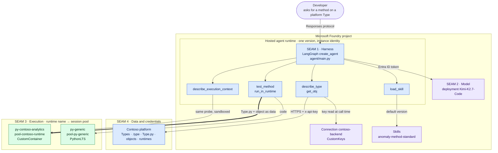
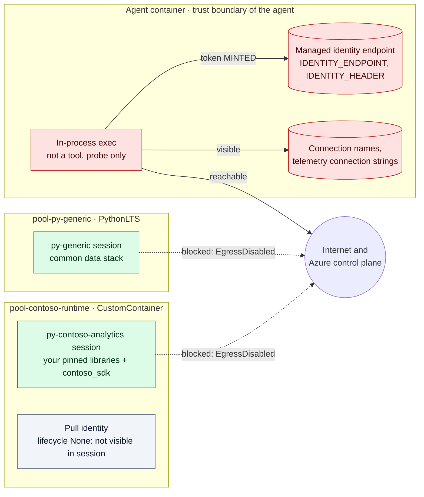
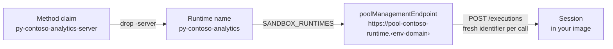
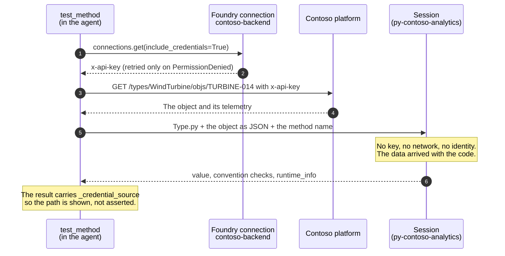
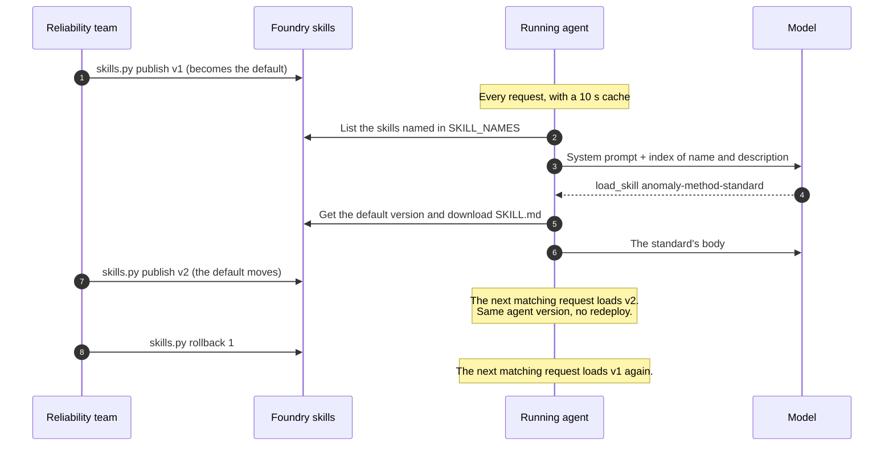
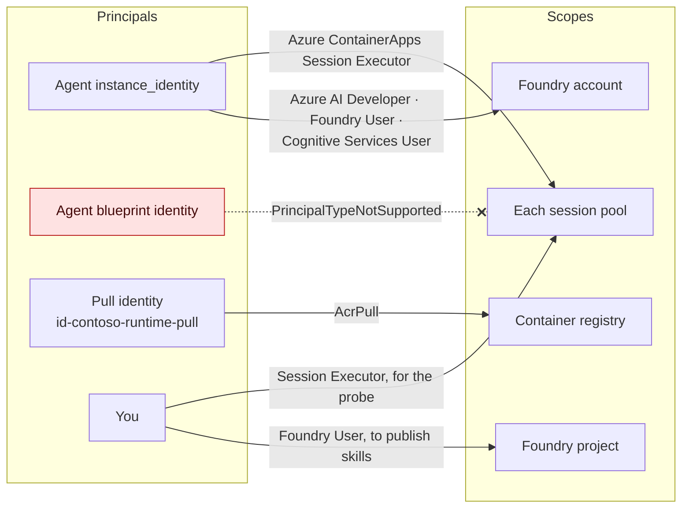

# Architecture — a platform coding agent on Foundry, and its four seams

One claim runs through this page: **three of the four seams belong to you, and
Foundry does not ask to own them.** The page also maps each piece of the
sample to what it represents in your own stack.

For the step-by-step build, see [`README.md`](README.md). For the custom
runtime, see [`sandbox/README.md`](sandbox/README.md).

---

## System context



Blue is code you own. Purple is a Foundry resource. Green is an isolated,
`EgressDisabled` sandbox.

| Seam | In this sample | Owner | Changes independently? |
| --- | --- | --- | --- |
| **1 · Harness** | LangGraph graph, six tools, the system prompt | You | Yes: your code, unchanged |
| **2 · Model** | `Kimi-K2.7-Code` (open-weight), a deployment in the Foundry project; `gpt-4.1-mini` as a baseline | Shared | Yes: change the deployment name |
| **3 · Execution** | Named runtimes mapped to session pools | You define the runtimes; Azure hosts the pools | Yes: a runtime is a manifest and an image |
| **4 · Data and credentials** | The platform API, reached with a key from a Foundry connection | Shared | Resolved at call time, never baked in |

## What each piece stands in for

| In this sample | What it represents in your stack |
| --- | --- |
| The agent: writes the `.type` declaration and `Type.py`, then tests on a real object | Your coding agent: natural language to code on your platform's type system |
| `describe_type` and `get_obj`, over the Contoso platform | The agent's view of your types and their data (`fetch`, `get`) |
| A **runtime** name (`py-contoso-analytics`) and a method **claim** (`py-contoso-analytics-server`) | How your platform declares which environment executes a method |
| The `SANDBOX_RUNTIMES` registry: runtime → session pool | The platform deciding which server executes a claim |
| `pool-contoso-runtime`, built from [`sandbox/runtime/py-contoso-analytics.json`](sandbox/runtime/py-contoso-analytics.json) | A frozen custom runtime with private libraries |
| `contoso_sdk`, a private wheel installed offline | Your platform's SDK, available inside a runtime (`contoso.<Type>`) |
| The skill `anomaly-method-standard` | A domain team's standard for how a class of method is written |

The Contoso platform, `contoso_sdk` and the Types are **fictional, written for
this sample**. They model only what matters here: the claim syntax, the
runtime manifest's shape, `this` and `cls`, and imports inside functions.

---

## Seam 1 — The harness (yours)

`create_agent()` from LangChain and LangGraph, hosted by `ResponsesHostServer`.
There is no Microsoft agent framework in [`agent/main.py`](agent/main.py). The
hosted runtime's contract is the **Responses protocol**, declared at deploy
time in [`deploy.py`](deploy.py):

```python
protocol_versions=[ProtocolVersionRecord(protocol="responses", version="2.0.0")]
```

The *agent's* own runtime is `python_3_13` plus
[`agent/requirements.txt`](agent/requirements.txt), which Foundry installs with
`dependency_resolution="remote_build"`. That is separate from the runtime that
model-written code executes in (seam 3).

**Consequence:** your harness moves unchanged. One LangGraph-specific trap: a
tool parameter named `runtime` is silently replaced by LangGraph's own
`ToolRuntime` ([F11](findings.md#f11--langgraph-silently-replaces-a-tool-parameter-named-runtime--sharp-edge)).
In a codebase where "runtime" is core vocabulary, that bites.

## Seam 2 — The model (shared)

The agent never holds a model key. It asks the project for an OpenAI-shaped
client and authenticates with `DefaultAzureCredential`:

```python
openai_client  = _project_client().get_openai_client()
token_provider = get_bearer_token_provider(_credential, "https://ai.azure.com/.default")
```

Swapping models means changing the deployment name, not the code. The same
code runs on the open-weight Kimi-K2.7-Code and on gpt-4.1-mini.

What does change with the model is the *shape* of what comes back. A reasoning
model's endpoint can return the final answer in the reasoning summary with an
empty message, and the harness has to cope
([F16](findings.md#f16--a-model-endpoint-can-return-the-answer-in-the-reasoning-summary--noted)).
A model can also claim a tool result it never obtained
([F14](findings.md#f14--a-model-can-report-a-tool-result-it-never-obtained--sharp-edge)).
Both are reasons to evaluate a model change before shipping it, the same way
you test a code change.

## Seam 3 — Execution (you own the runtimes; Azure hosts the pools)

This is the seam that matters most. There are three places code could run, and
the sample measures all three
([`sample-output/04-in-process-vs-sandbox.txt`](sample-output/04-in-process-vs-sandbox.txt)):



| | In-process (not a tool) | `py-generic` → `pool-py-generic` | `py-contoso-analytics` → `pool-contoso-runtime` |
| --- | --- | --- | --- |
| Runs where | inside the agent container | a Microsoft-managed PythonLTS session | a **custom-container** session from your image |
| Libraries | whatever the agent has | the common data stack | **declared, pinned, frozen**, plus a private wheel |
| Sees agent environment variables and secrets | **yes** | no | no |
| Can mint the agent's identity | **yes (measured `MINTED`)** | no | no (no identity endpoint visible; the pull identity has lifecycle `None`) |
| Egress | open | blocked (`EgressDisabled`) | blocked (`EgressDisabled`) |
| Can test a platform method | — | **no** (`RUNTIME_CANNOT_TEST`) | yes |

The in-process mode exists only so `describe_execution_context` can show the
contrast. No tool runs model-written code in-process.

**How a claim finds its pool.** The registry is deploy-time configuration, not
code:



Adding a runtime is a new entry in `SANDBOX_RUNTIMES` and an agent redeploy.
Changing what is *in* a runtime is a new image tag and a pool redeploy, with no
agent change. The custom pool's URL form differs from a managed pool's
([F3](findings.md#f3--a-custom-container-pool-is-not-reachable-at-the-managed-pools-url--sharp-edge)).

**Consequence:** model-written code never needs to run next to the agent's
identity. The execution backend is your runtime definition, hosted as a pool.
If your existing backend must stay where it is, the same `test_method`
shape can call that backend instead. Only the tool layer changes.

## Seam 4 — Data and credentials (shared, resolved at run time)



The platform's API key lives in a **Foundry connection** and is read when the
tool runs. It is never written to disk, baked into the image or placed in the
prompt, so rotating it needs no redeploy. Objects are fetched *in the agent* and
passed to the sandbox **as data**, so the sandbox needs neither network nor
credentials.

Connection reads can fail intermittently with `PermissionDenied`, so the read
is retried and any retry is reported
([F7](findings.md#f7--connection-reads-intermittently-return-permissiondenied--sharp-edge)).

---

## Above the seams — team standards live in Foundry skills

How your teams want code written lives in **Foundry skills**, versioned in the
project, not in the agent's image.



This is progressive disclosure. Only the name and description of each skill
are in the prompt; a matching request loads the body. The allow-list
(`SKILL_NAMES`) is deploy-time configuration, so a new skill cannot inject
itself. A new *version* of an allow-listed skill can.

Agent Framework has a built-in `SkillsProvider`. LangGraph does not, so this is
about 70 lines in [`agent/main.py`](agent/main.py) (section 5) against the
public `beta.skills` API: a non-Microsoft harness consuming a Foundry platform
resource.

**What changes when you change something:**

| When you… | Harness code | Agent version | Runtime image | Skill default |
| --- | --- | --- | --- | --- |
| edit `agent/main.py` | ✔ | new, via `deploy.py` | — | — |
| edit `sandbox/runtime/*.json` | — | — | new tag, redeploy the pool | — |
| add a runtime to `SANDBOX_RUNTIMES` | — | new, via `deploy.py` | — | — |
| publish or roll back a skill | — | **unchanged** | — | ✔ on the next request |

Skill v2 only works because the runtime ships `ruptures`. The standard and the
runtime are separate artifacts, owned by different people, and they depend on
each other. That is a real coordination point.

---

## Identity and access



- A deployed hosted agent has **two** identities. Grant roles to
  `instance_identity`. The blueprint principal cannot be used in a role
  assignment
  ([F6](findings.md#f6--the-blueprint-identity-cannot-be-used-in-a-role-assignment--sharp-edge)).
- A new agent has **no** role assignments. It needs Session Executor on
  **each** pool in `SANDBOX_RUNTIMES`, and the three account-scope roles to
  read the connection. Project scope is not enough
  ([F5](findings.md#f5--a-hosted-agent-deploys-with-no-role-assignments-and-project-scope-grants-are-not-enough--sharp-edge)).
- The custom pool has its own user-assigned identity. It exists only to pull
  the image from the registry, and the pool sets its `lifecycle` to `None`, so
  the identity is not exposed inside sessions.

---

## Deliberately not in this picture

- **VNet integration.** Everything uses public endpoints, which keeps the
  sample simple to reproduce. The sandboxes still have egress disabled.
- **MCP on the custom pool.** It is not possible today
  ([F1](findings.md#f1--mcp-cannot-be-enabled-on-a-custom-container-session-pool--blocking)).
  The agent calls the pool's REST API from its tool layer.
- **Code Interpreter** as a fourth execution mode. It is not used here.
