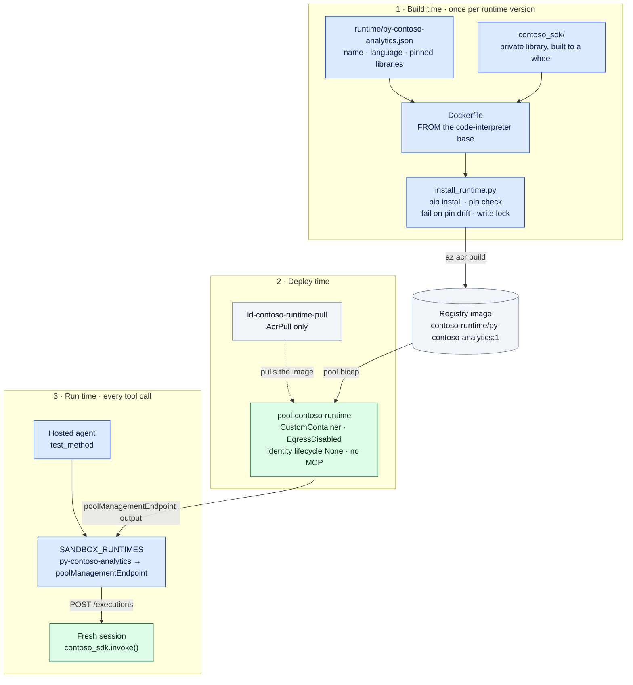

# Custom runtime walkthrough — `py-contoso-analytics`

How the agent gets a sandbox with **its own environment, pinned dependencies
and a private library**. Also how a platform method *claims* that environment
on the (fictional) Contoso platform.

This page explains each piece. The condensed commands are in step 4 of the
main [`README.md`](../README.md#step-4--the-custom-runtime-image-pull-identity-and-pool).
Every number was measured against a live environment; the raw output is in
[`../sample-output/`](../sample-output/).

---

## The idea in one table

On the Contoso platform, a method's implementation does not pick a Python
interpreter. It **claims a runtime**, by name, at the end of its declaration.
The platform runs it wherever that runtime lives. We kept that model and put
Azure underneath it:

| Platform concept | In this sample | Azure resource |
| --- | --- | --- |
| Runtime: name, language version, `libraries` as `{manager} {spec} [{url}]` | [`runtime/py-contoso-analytics.json`](runtime/py-contoso-analytics.json) | — |
| A frozen runtime | [`install_runtime.py`](install_runtime.py) writes `py-contoso-analytics.resolved.json` at image build | the image **digest** in ACR |
| A private package | [`contoso_sdk/`](contoso_sdk/), installed from `file:///opt/contoso/wheels/…` | baked into the image, on no public index |
| Method claim `… : double py-contoso-analytics-server` | the `.type` declaration the agent writes | — |
| The server that runs the claim | `SANDBOX_RUNTIMES["py-contoso-analytics"]` in the agent's deploy config | ACA session pool **`pool-contoso-runtime`** (`CustomContainer`) |
| A generic runtime methods may not claim | `py-generic` | ACA session pool `pool-py-generic` (managed `PythonLTS`) |

The agent's harness (LangGraph, in [`../agent/main.py`](../agent/main.py)) and
the code's runtime are **separate things**:

- `deploy.py` builds the *agent* runtime with `remote_build`.
- This folder builds the *code* runtime.

Model-written code never runs in the agent's process. Scenario 3 in the main README shows why.



---

## Step 1 — Declare the runtime

[`runtime/py-contoso-analytics.json`](runtime/py-contoso-analytics.json):

```json
{
  "name": "py-contoso-analytics",
  "languageVersion": "3.12",
  "repositories": ["pypi", "file:///opt/contoso/wheels"],
  "libraries": [
    "pip numpy==1.26.4",
    "pip pandas==2.2.3",
    "pip scipy==1.14.1",
    "pip scikit-learn==1.5.2",
    "pip ruptures==1.1.9",
    "pip contoso_sdk==0.3.0 file:///opt/contoso/wheels/contoso_sdk-0.3.0-py3-none-any.whl"
  ]
}
```

The manifest follows two naming rules:

- The name is lowercase and starts with `py-`.
- Each library is written as `{package manager} {package spec} [{install url}]`.

Three choices worth noting:

- **`ruptures`** (change-point detection) is the library the generic runtime
  does not have. It is what makes skill v2 (scenario 4) possible *only* here.
- **`contoso_sdk`** is private. It is installed from a file URL, which is the path
  any private or licensed package of your own would take.
- **`numpy==1.26.4`** matches the base image on purpose. Moving numpy under
  the ~670 packages the base image already ships breaks their compiled
  extensions.

## Step 2 — The private library

[`contoso_sdk/contoso_sdk/__init__.py`](contoso_sdk/contoso_sdk/__init__.py) is the
offline half of the runtime: about 170 lines, a fictional platform SDK built
for this sample. It loads a generated `Type.py` file the way the
platform would, and `invoke()` checks the conventions while it runs the
method:

| Convention | Enforced by |
| --- | --- |
| Top-level functions named after the methods | `invoke()` raises if `Type.py` has no such function |
| `this` first for member methods, `cls` for static | `invoke()` raises `TypeError` otherwise |
| A global `contoso` namespace is available in the file | `load_impl()` injects `contoso` |
| Third-party imports go inside functions | `conventions.top_level_third_party_imports`, via `ast` |

So a sandbox test is also a lint. The runtime also reports its own identity
through `contoso_sdk.runtime_info()`: the name, the declared libraries, and the
lock hash from Step 3.

## Step 3 — Freeze it at build time

[`Dockerfile`](Dockerfile):

```dockerfile
FROM mcr.microsoft.com/k8se/services/codeinterpreter:0.9.18-python3.12
USER root
ARG RUNTIME=py-contoso-analytics
ENV CONTOSO_RUNTIME=${RUNTIME}
COPY contoso_sdk /opt/contoso/src/contoso_sdk
RUN python -m pip wheel --no-cache-dir --no-deps -w /opt/contoso/wheels /opt/contoso/src/contoso_sdk
COPY runtime/${RUNTIME}.json /opt/contoso/runtime/${RUNTIME}.json
COPY install_runtime.py /opt/contoso/install_runtime.py
RUN python /opt/contoso/install_runtime.py /opt/contoso/runtime/${RUNTIME}.json
```

**Why this base image:** it is the image behind managed code-interpreter
sessions. It already serves the dynamic-sessions `/executions` API on port
6000, so the agent calls this custom pool *exactly* the way it calls a managed
one. There is no second client, and you do not have to write an execution
server.

[`install_runtime.py`](install_runtime.py) runs once, at build time. It:

1. Rejects a bad name or a Python version mismatch.
2. Runs `pip install` on the declared libraries.
3. Runs `pip check`.
4. **Fails the build** if any pin resolved to anything other than exactly what
   was declared.
5. Writes the full resolution to `/opt/contoso/runtime/py-contoso-analytics.resolved.json`.

From the real build log ([`../sample-output/01-runtime-image-build.txt`](../sample-output/01-runtime-image-build.txt)):

```
Resolving py-contoso-analytics (6 declared libraries)
Installing collected packages: scipy, contoso_sdk, scikit-learn, ruptures, pandas
gensim 4.3.3 has requirement scipy<1.14.0,>=1.7.0, but you have scipy 1.14.1.
  numpy==1.26.4
  pandas==2.2.3
  scipy==1.14.1
  scikit-learn==1.5.2
  ruptures==1.1.9
  contoso_sdk==0.3.0
Froze 670 packages -> /opt/contoso/runtime/py-contoso-analytics.resolved.json (sha256 7a5432a6fff92406)
```

> **A real finding:** `pip check` caught a conflict with a package
> we never asked for. The base image ships `gensim`, which wants
> `scipy<1.14`. A fat base image means you inherit its dependency graph. Your
> choices are:
>
> - pin `scipy==1.13.1`;
> - accept it, because nothing claims gensim in this runtime;
> - build `FROM` a slimmer base and serve `/executions` yourself.
>
> The freeze step is what made the conflict visible.

## Step 4 — Build it in ACR

From the `coding-agent-custom-runtime` folder:

```powershell
az acr build -r <registry> -t contoso-runtime/py-contoso-analytics:1 --no-logs sandbox
az acr task list-runs -r <registry> --top 1 -o table     # poll; log streaming is flaky
```

Measured:

- **About 11 minutes** for the build, dominated by pulling the base image.
- **About 15 minutes** to push to a **Basic** ACR, because the image is large.
- **26 minutes** end to end.

This happens once per runtime version, not per session. Plan for it, and do
not rebuild right before a demo.

## Step 5 — A pull identity, not a session identity

```powershell
az identity create -g <resource-group> -n id-contoso-runtime-pull
az role assignment create --assignee-object-id <principalId> --assignee-principal-type ServicePrincipal `
  --role AcrPull --scope <ACR resource id>
```

The identity exists so the **pool** can pull the image. It must not be
reachable from code running in a session. That is the next step.

## Step 6 — The pool

[`pool.bicep`](pool.bicep) declares a `Microsoft.App/sessionPools@2025-10-02-preview`
with `containerType: CustomContainer`. Three settings carry the security story:

| Setting | Value | Why |
| --- | --- | --- |
| `sessionNetworkConfiguration.status` | `EgressDisabled` | Model-written code cannot reach the internet or Azure. It is a **pool setting, not a default**, and it is independent of the Foundry account's network posture ([F2](../findings.md#f2--sandbox-egress-is-a-pool-setting-independent-of-your-foundry-network-posture--sharp-edge)). |
| `managedIdentitySettings[].lifecycle` | `None` | The UAMI is used for the image pull only and is never exposed inside the session. |
| `mcpServerSettings` | *(absent)* | MCP cannot be enabled on a `CustomContainer` pool today ([F1](../findings.md#f1--mcp-cannot-be-enabled-on-a-custom-container-session-pool--blocking)). The agent calls the pool's REST API from its tool layer instead. |

```powershell
az deployment group create -g <resource-group> -f sandbox/pool.bicep `
  -p environmentId=<ACA environment id> pullIdentityId=<UAMI id> `
     image=<registry>.azurecr.io/contoso-runtime/py-contoso-analytics:1
```

Measured: **1,196 s (about 20 minutes)** for the deployment to finish. Ready
sessions appeared at about minute 15. After that, `readySessionInstances: 2`
stay warm. (A separate test of a similar pool took about 9 minutes, so treat
the time as variable.)

The template's `poolManagementEndpoint` output is the URL the agent must call.
Keep it; Step 8 needs it.

## Step 7 — Who may execute code in it

A pool accepts `/executions` only from principals holding
**`Azure ContainerApps Session Executor`** on it. For this sample that means:

- the hosted agent's **`instance_identity`** (not its blueprint identity; [F6](../findings.md#f6--the-blueprint-identity-cannot-be-used-in-a-role-assignment--sharp-edge));
- you, for the probe below.

```powershell
az role assignment create --assignee-object-id <instance_identity.principal_id> `
  --assignee-principal-type ServicePrincipal `
  --role "Azure ContainerApps Session Executor" --scope <pool resource id>
```

## Step 8 — Tell the agent the runtime exists

The agent has a **runtime registry**, not a hard-coded pool. In
[`../env.example.ps1`](../env.example.ps1):

```powershell
$pools = "https://<region>.dynamicsessions.io/subscriptions/<sub>/resourceGroups/<rg>/sessionPools"
$env:SANDBOX_RUNTIMES = @{
  "py-contoso-analytics" = "https://pool-contoso-runtime.<env-domain>.azurecontainerapps.io"  # custom container: poolManagementEndpoint
  "py-generic"      = "$pools/pool-py-generic"                                      # managed PythonLTS
} | ConvertTo-Json -Compress
$env:DEFAULT_RUNTIME = "py-contoso-analytics"
```

> **The two pool kinds use different URLs ([F3](../findings.md#f3--a-custom-container-pool-is-not-reachable-at-the-managed-pools-url--sharp-edge)).** A managed pool accepts the
> regional `dynamicsessions.io/.../sessionPools/<name>` form. A
> `CustomContainer` pool **rejects** that form with
> `DynamicApisNotAllowed: the pool is not dynamic`. You must use its
> `poolManagementEndpoint`
> (`https://<pool>.<env-domain>.azurecontainerapps.io`). The path
> (`/executions?api-version=2025-02-02-preview&identifier=…`) and the token
> audience (`https://dynamicsessions.io/.default`) are the same, so the agent's
> client code does not change. Only the registry entry does.

`deploy.py` passes these through to the hosted agent. Adding a runtime is a
config change and a redeploy of the agent. It needs no code change. A method
claim like `py-contoso-analytics-server` resolves to a runtime by dropping the
`-server` suffix.

## Step 9 — Prove what is inside

```powershell
python sandbox\probe_runtime.py py-generic
python sandbox\probe_runtime.py py-contoso-analytics
```

The same probe runs in both pools ([`../sample-output/02-runtime-probe.txt`](../sample-output/02-runtime-probe.txt);
the managed pool in that recording is named `pool-warm`):

| | `py-generic` (managed pool) | `py-contoso-analytics` (`pool-contoso-runtime`) |
| --- | --- | --- |
| Python | 3.12.7 | 3.12.7 |
| numpy / pandas / scipy / scikit-learn | 1.26.4 / 2.2.2 / 1.13.1 / 1.5.1 | 1.26.4 / **2.2.3 / 1.14.1 / 1.5.2** (the manifest's pins) |
| **ruptures** | **not installed** | **1.1.9** |
| **contoso_sdk** (private) | **not installed** | **0.3.0** |
| `CONTOSO_RUNTIME` | — | `py-contoso-analytics` |
| Lock sha256 (670 pinned packages) | — | `7a5432a6fff92406` |
| Probe, end to end (new session, including allocation) | 4,144 ms | 4,374 ms |

That table is the whole point of a custom runtime. The generic pool can run
Python, but it cannot run *your* method, because your method needs a
library it does not have and a platform shim nobody else has.

> **A second real finding: ghost metadata ([F4](../findings.md#f4--a-custom-runtime-inherits-its-base-images-dependency-graph--noted)).** In the custom pool,
> `importlib.metadata.version("pandas")` returns **`None`**, and the same is
> true for scipy and scikit-learn. The imports themselves are correct
> (`pandas.__version__ == "2.2.3"`). Upgrading a package that the base image
> already ships deletes the old `*.dist-info` folder in a new image layer. The
> session filesystem still *lists* the deleted folder, but it cannot read it.
> Anything that trusts package metadata will see the wrong answer: `pip list`,
> SBOM scanners, and `importlib.metadata` itself.
>
> That is why `probe_runtime.py` reports the imported `__version__` and prints
> `(metadata says None)`. There are two clean fixes:
>
> - pin to the versions the base image ships, so pip upgrades nothing;
> - install the runtime into its own prefix or virtual environment.

## Step 10 — The agent uses it

`test_method` in [`../agent/main.py`](../agent/main.py) is the only way
the agent executes a platform method. It works in three steps.

1. **In the agent process,** it fetches the real object from the platform
   with the Foundry-connection credential.
2. **It sends** the generated `Type.py`, the object (as data) and the method
   name to the pool of the runtime the method claims.
3. **In the sandbox,** `contoso_sdk.invoke()` loads the file, calls the method
   on the object, and returns:
   - the value;
   - the convention checks;
   - `runtime_info()`: runtime name and lock hash.

The sandbox needs no network and no credentials, because the data arrives
with the code. If the model tries to test in `py-generic`, the harness returns
`RUNTIME_CANNOT_TEST`, because `contoso_sdk` is not there.

Measured from the agent, through the same tool (sample outputs 05, 06 and 07):

| Method under test | Sandbox time | Tool call, end to end |
| --- | --- | --- |
| Robust z-score (numpy only), skill v1 | 12–23 ms | 185–367 ms |
| PELT change point (imports `ruptures`), skill v2 | 968–1,048 ms | 1.2–1.3 s |

The difference is almost entirely the first `import ruptures` in a fresh
session. It is not the method.

---

## Changing the runtime

1. Edit the manifest. Bump a pin, add a library, or add a private wheel.
2. Rebuild the image with a **new tag** (`:2`). Never overwrite a tag a pool
   is using.
3. Redeploy `pool.bicep` with the new `image=`.
4. Re-run `probe_runtime.py` and check the lock hash changed.

Existing methods keep their claim, so only the runtime moved. For true
side-by-side versions, create a second runtime and a second pool (for
example `py-contoso-analytics-2`), and move claims across deliberately.

## What this does not cover

- **VNet integration** of the pool. It is out of scope for this sample.
- **A slim base image** that serves `/executions` itself. It is possible,
  but you then own the execution server.
- **MCP on a custom pool** ([F1](../findings.md#f1--mcp-cannot-be-enabled-on-a-custom-container-session-pool--blocking)): not possible today.
- **Per-tenant runtimes.** One pool per tenant is the simple answer. Whether
  you need it depends on whether your customers author the code that runs there.
